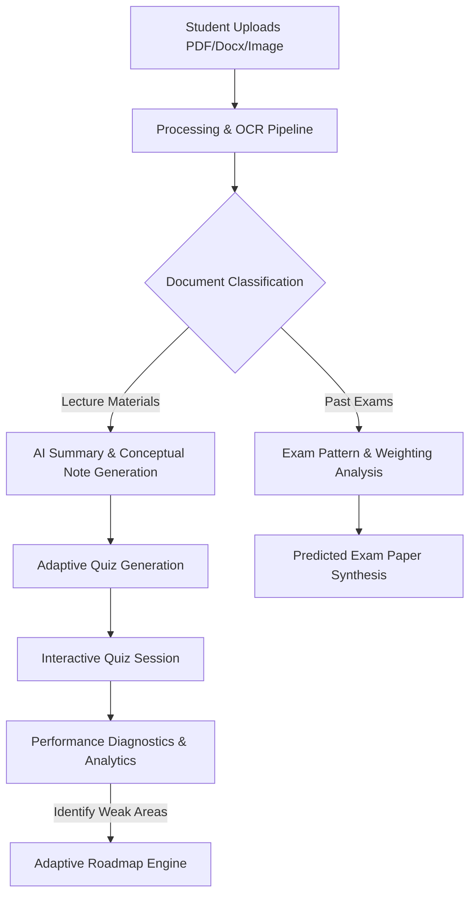
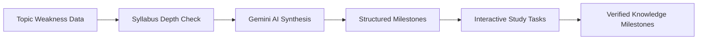
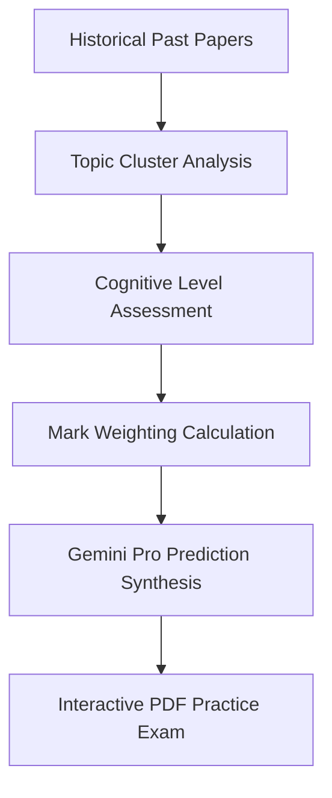

<div align="center">

# 🧠 StudyMind AI
### The Personalized Academic Intelligence Platform for Modern Students

[](https://nextjs.org/)
[](https://www.typescriptlang.org/)
[](https://tailwindcss.com/)
[](https://supabase.com/)
[](https://deepmind.google/technologies/gemini/)
[](https://vercel.com/)
[](https://render.com/)
[](https://opensource.org/licenses/MIT)

**StudyMind AI** is a production-grade, full-stack academic copilot engineered for university students. It transforms passive resources—lecture slides, textbook PDFs, hand-written notes, and past exam papers—into dynamic, hyper-personalized learning pipelines complete with verified roadmaps, AI-generated practice assessments, and automated subject difficulty analytics.

[Explore Live Demo](https://studymind-ai.vercel.app) • [View API Docs](http://localhost:5000/api/health) • [Report Bug](https://github.com/username/StudyMind-AI/issues)

---

</div>

## 📺 Demo & Visual Tour

<div align="center">
  <table border="0">
    <tr>
      <td width="50%" align="center">
        <strong>✨ Clean Landing UI</strong><br/>
        
      </td>
      <td width="50%" align="center">
        <strong>📊 Analytics Dashboard</strong><br/>
        
      </td>
    </tr>
    <tr>
      <td width="50%" align="center">
        <strong>🛣️ Adaptive Roadmap Generator</strong><br/>
        
      </td>
      <td width="50%" align="center">
        <strong>✏️ Handwriting Mode (A4 Export)</strong><br/>
        
      </td>
    </tr>
  </table>
</div>

---

## 💡 Why StudyMind AI?

### The Problem We Solve
Traditional studying is **linear, passive, and generalized**. Students are overwhelmed by:
- **Information overload**: Thousands of pages of lecture slides and textbooks.
- **Vague progress**: No concrete mechanism to check true readiness before an exam.
- **Irrelevant prep**: Study resources fail to align with their specific university curriculum or the historical patterns of past exam papers.

### The Solution: StudyMind AI
We turn static academic content into an **active learning feedback loop**. StudyMind AI ingests syllabus files, notes, and past exams to auto-tailor roadmaps, generate custom quizzes, diagnose topic weaknesses, and predict upcoming exam questions—built exactly to your university's guidelines.

### Real Student Use Cases
*   **The Night-Before Exam Prep**: Upload past papers to generate a customized mock exam featuring question patterns most likely to appear.
*   **Conceptual Mastery**: Upload messy lecture recordings/documents, extract text with built-in OCR, and generate printable A4 notebook sheets formatted for optimal retention.
*   **Closing the Loop**: Take diagnostic quizzes, instantly see your "Weak Topics" update on the dashboard, and click one button to generate a structured remedial roadmap.

---

## ⚙️ AI Workflows & Architecture

### 🌀 AI Processing Workflow


### 🛣️ Roadmap Generation Engine


### 📝 Past Paper Analytics System


---

## ⚡ Core Features

-   **🧠 AI Notes & Key Points**
    Extracts core concepts, key formulas, and high-yield study topics. Support for raw Markdown renders and LaTeX styling for mathematical equations.
-   **✍️ Handwriting Mode**
    Renders digital study materials onto beautiful, structured A4 notebook templates. Perfect for tablets or printing for focused handwriting.
-   **🎯 Adaptive Quiz Generator**
    Dynamically generates Multiple Choice Questions (MCQs), short theories, and scenario questions. Integrated countdown timers mimic exam pressure.
-   **📈 Diagnostic Weak Topic Tracking**
    Automatically tracks low-performing concepts from quiz results, visualizes them on charts, and builds immediate recovery plans.
-   **🛣️ Custom Study Roadmaps**
    Generates step-by-step progress timelines tailored around your examination target date, syllabus, and available daily hours.
-   **🔒 Verified Milestone Progress**
    Allows students to submit notes/evidence of task completion to check their understanding using automated AI grading before moving ahead.
-   **📑 Past Paper Intelligence**
    Ingests multiple years of university exam papers to analyze recurring subject patterns, structural focus, and weighting trends.
-   **🔮 Predicted Exam Papers**
    Generates realistic practice exams modeled directly on historical distributions, syllabus changes, and question structure.
-   **📊 Dashboard Analytics**
    A complete bird's-eye view of your learning habits, covering exam readiness meters, weekly time logs, and topic distribution charts.

---

## 🛠️ Tech Stack

### Frontend & Client
| Technology | Description | Use Case |
| :--- | :--- | :--- |
| **Next.js 15 (App Router)** | React Framework | Core SPA Routing & Server-Side Rendering |
| **TypeScript** | Static Typing | Type-safe state, API response models, and safety |
| **Tailwind CSS** | Styling | Responsive layout, dark/light modes, premium components |
| **Framer Motion** | Animation Library | UI transitions, page routing animations, micro-interactions |
| **Zustand** | State Management | Global store managing auth context, profiles, settings |
| **Recharts** | Data Visualization | Interactive learning metrics, charts, weak topics graphs |

### Backend & Infrastructure
| Technology | Description | Use Case |
| :--- | :--- | :--- |
| **Node.js / Express** | REST API Server | Orchestrates AI operations, OCR pipelines, and database logic |
| **Supabase Client** | BaaS Platform | High-performance user authentication & PostgreSQL queries |
| **Supabase Auth** | Security Gateway | Secured sessions, route guards, OTP credentials, RLS controls |
| **Supabase Storage** | Blob Storage | Secure file ingestion (PDF, DOCX, study images) |

### AI & Text Processing
| Technology | Description | Use Case |
| :--- | :--- | :--- |
| **Google Gemini 1.5** | Core LLM Fallback | High-volume synthesis, summary formatting, semantic routing |
| **OpenRouter / DeepSeek** | Premium LLM Hub | Advanced reasoning for past paper predictions, quizzes, roadmaps |
| **pdf-parse / Mammoth** | Extraction Tools | Document parser for native PDF and DOCX uploads |
| **Tesseract.js** | Client/Server OCR | Multi-lingual optical character recognition for study images |

---

## 🔒 Security & Authentication

StudyMind AI is built with modern security architectures to protect user data:
*   **Supabase RLS (Row Level Security)**: Ensures that users can *only* read, write, or delete their own documents, roadmaps, and profile information.
*   **JSON Web Tokens (JWT)**: Strict JWT validation via Authorization headers on all backend routing.
*   **Passwordless Email Verification**: Secure OTP verification for logins and registration to prevent credential harvesting.
*   **Admin SDK Isolation**: Critical admin privileges (e.g. database schema migrations or auth deletions) are contained securely in server runtime.

---

## 📂 Project Structure

```
StudyMind-AI/
├── frontend/                   # Next.js App Router Client
│   ├── app/                    # App Router pages (auth, dashboard, roadmap, etc.)
│   ├── components/             # Reusable UI elements (brand, charts, layout, cards)
│   ├── hooks/                  # Custom React hooks (auth, database triggers)
│   ├── lib/                    # SDK initializations (Supabase Client, utils)
│   ├── services/               # API interaction layers & endpoints mapping
│   ├── store/                  # Zustand stores (global state, user profiles)
│   └── types/                  # Shared TypeScript interfaces & types
│
├── backend/                    # Express REST API Server
│   ├── src/
│   │   ├── config/             # Environment setup, database connections
│   │   ├── controllers/        # Express handlers (uploads, quizzes, roadmaps, users)
│   │   ├── middleware/         # Auth verification guards & request validators
│   │   ├── routes/             # REST route bindings
│   │   ├── services/           # Business services (AI integrations, email templates, OTP)
│   │   ├── utils/              # Response formats, error templates
│   │   └── app.ts              # Express initialization
│
└── supabase/                   # Supabase Database Migrations & Schemas
    ├── schema.sql              # Core database schema (users, roadmaps, etc.)
    └── migrations/             # Local database patch files
```

---

## 🚀 Getting Started

### Prerequisites
*   Node.js (v18 or higher)
*   npm (v9 or higher)
*   A Supabase account

### Step 1: Clone the Repository
```bash
git clone https://github.com/your-username/StudyMind-AI.git
cd StudyMind-AI
```

### Step 2: Backend Configuration
1. Navigate to the backend directory and install dependencies:
   ```bash
   cd backend
   npm install
   ```
2. Create your local environment configuration:
   ```bash
   cp .env.example .env
   ```
3. Open `.env` and fill in the required values:
   ```env
   PORT=5000
   SUPABASE_URL=your_supabase_url
   SUPABASE_SERVICE_ROLE_KEY=your_supabase_service_role_key
   OPENROUTER_API_KEY=your_openrouter_key
   GEMINI_API_KEY=your_gemini_key
   FRONTEND_URL=http://localhost:3000
   ```

### Step 3: Database Setup
1. Log in to [Supabase Console](https://supabase.com).
2. Go to the SQL Editor in your dashboard and paste the contents of `supabase/schema.sql`.
3. If uploads require specific table path adjustments, apply `supabase/migrations/001_fix_uploads_table.sql`.
4. Create a **Private Storage Bucket** named `study-materials`.
5. Enable **Email Auth** with standard OTP verification enabled.

### Step 4: Frontend Configuration
1. Navigate to the frontend directory and install dependencies:
   ```bash
   cd ../frontend
   npm install
   ```
2. Create your environment configuration:
   ```bash
   cp .env.example .env.local
   ```
3. Open `.env.local` and add the variables:
   ```env
   NEXT_PUBLIC_SUPABASE_URL=your_supabase_url
   NEXT_PUBLIC_SUPABASE_ANON_KEY=your_supabase_anon_key
   NEXT_PUBLIC_API_URL=http://localhost:5000/api
   ```

### Step 5: Start Development Servers
You will need two separate terminal windows (or use the configured tasks).

**Start the Backend API:**
```bash
cd backend
npm run dev
```
*API running at: `http://localhost:5000`*

**Start the Frontend App:**
```bash
cd frontend
npm run dev
```
*Frontend running at: `http://localhost:3000`*

---

## 🚀 Deployment Guide

### Frontend (Vercel)
1. Push your code to GitHub.
2. Link your repository in [Vercel](https://vercel.com).
3. Set the **Root Directory** to `frontend/`.
4. Configure the environment variables (`NEXT_PUBLIC_SUPABASE_URL`, `NEXT_PUBLIC_SUPABASE_ANON_KEY`, `NEXT_PUBLIC_API_URL`) in Vercel.
5. Deploy.

### Backend (Render / Railway)
1. Create a Web Service linked to the repository.
2. In **Render**, the service will detect `backend/render.yaml` automatically.
3. Configure the start command: `npm run build && npm start`.
4. Provide the `.env` parameters in the Environment section.
5. Deploy.

---

## 🔮 Future Roadmap & Enhancements

*   **📱 Native Companion App**: Build cross-platform Android/iOS applications using React Native.
*   **💬 Real-time AI Study Group Tutor**: Interactive study rooms where an AI agent prompts students and moderate discussions.
*   **👥 Collaborative Notes & Quiz Challenges**: Multiplayer quiz leagues for classrooms.
*   **📴 Offline Revision mode**: Local caching of generated notes and interactive study guides.
*   **🎙️ Voice-Activated Lecture Companion**: Audio streaming with real-time text transcription and semantic indexing.

---

## 🤝 Contributors

Contributions make the open-source community an amazing place to learn, inspire, and create. Any contributions you make are **greatly appreciated**.

1. Fork the Project
2. Create your Feature Branch (`git checkout -b feature/AmazingFeature`)
3. Commit your Changes (`git commit -m 'Add some AmazingFeature'`)
4. Push to the Branch (`git push origin feature/AmazingFeature`)
5. Open a Pull Request

---

## 📄 License

Distributed under the MIT License. See [LICENSE](LICENSE) for more details.

---

## 📞 Support & Feedback

If you find this project useful, please consider giving it a ⭐!
For assistance, bug reports, or feature requests, feel free to open a ticket in the GitHub Issues section.

<div align="center">
  <sub>Built with ❤️ for students, by StudyMind AI team.</sub>
</div>
